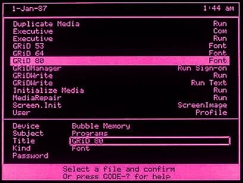
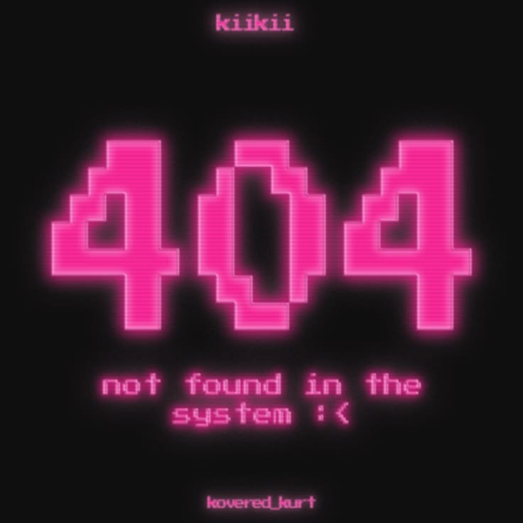

<div align="center">


<br>

<h1>⋆𐙚₊˚⊹♡ Amanda Folly</h1>

<h3>Backend & Web3 Developer in Training</h3>

<p>
Linux · Blockchain · Artificial Intelligence · Digital Products
</p>

<code>building technology with purpose, curiosity and a little pink glow</code>

</div>

<br>

```bash
  ₊˚ ୨୧ Welcome to my terminal, mandy ♡ ୨୧ ˚₊
╭─ ୨୧ mandy ♡ ~
╰─ ✦ cat about-me.txt
```

<table>
<tr>

<td width="65%" valign="top">

<h2>⌨ About me</h2>

<p>
I am a backend and Web3 developer in training, with hands-on experience
building digital products and configuring development environments.
</p>

<p>
My current work combines <strong>backend development, Linux, blockchain
infrastructure and applied artificial intelligence</strong>.
</p>

<p>
I am comfortable working with <strong>Linux Mint, Bash, Git and terminal-based
workflows</strong>, including environment setup, debugging and technical
troubleshooting.
</p>

<p>
In Web3, I have practical experience configuring and working with the
<strong>Celo network</strong>, Ethereum-compatible environments, digital
wallets, transactions and smart contracts.
</p>

<p>
↪ Backend development with Python, PHP, JavaScript and TypeScript<br>
↪ Web applications with HTML, CSS, React and Vite<br>
↪ APIs, databases, authentication and application security<br>
↪ Blockchain networks, wallets and smart-contract development<br>
↪ Generative AI applied to products, research and development workflows
</p>

<details>
<summary><strong>Português</strong></summary>

<br>

<p>
Sou desenvolvedora de back-end e Web3 em formação, com experiência prática
na construção de produtos digitais e na configuração de ambientes de
desenvolvimento.
</p>

<p>
Meu trabalho atual combina <strong>desenvolvimento back-end, Linux,
infraestrutura blockchain e inteligência artificial aplicada</strong>.
</p>

<p>
Tenho familiaridade com <strong>Linux Mint, Bash, Git e fluxos de trabalho
baseados em terminal</strong>, incluindo configuração de ambientes,
depuração e resolução de problemas técnicos.
</p>

<p>
Em Web3, tenho experiência prática com a configuração e o uso da
<strong>rede Celo</strong>, ambientes compatíveis com Ethereum, carteiras
digitais, transações e contratos inteligentes.
</p>

<p>
↪ Desenvolvimento back-end com Python, PHP, JavaScript e TypeScript<br>
↪ Aplicações web com HTML, CSS, React e Vite<br>
↪ APIs, bancos de dados, autenticação e segurança de aplicações<br>
↪ Redes blockchain, carteiras e desenvolvimento de smart contracts<br>
↪ IA generativa aplicada a produtos, pesquisa e desenvolvimento
</p>

</details>

</td>

<td width="35%" align="center" valign="middle">


</td>

</tr>
</table>

<br>

```bash
╭─ ୨୧ mandy ♡ ~
╰─ ✦ ls technologies/
```

<div align="center">


&nbsp;&nbsp;&nbsp;

&nbsp;&nbsp;&nbsp;

&nbsp;&nbsp;&nbsp;

&nbsp;&nbsp;&nbsp;

&nbsp;&nbsp;&nbsp;


<br><br>


&nbsp;&nbsp;&nbsp;

&nbsp;&nbsp;&nbsp;

&nbsp;&nbsp;&nbsp;

&nbsp;&nbsp;&nbsp;

&nbsp;&nbsp;&nbsp;


</div>

<br>

<div align="center">


</div>

<br>

```bash
╭─ ୨୧ mandy ♡ ~
╰─ ✦ cat web3-and-ai.txt
```

<table>
<tr>

<td width="65%" valign="top">

<h2>ᯤ Web3, blockchain and AI</h2>

<p>
My interest in Web3 goes beyond the interface. I am interested in the
infrastructure behind decentralized products: networks, wallets,
transactions, smart contracts and application integrations.
</p>

<p>
My current areas of exploration include:
</p>

<p>
↪ Celo and Ethereum-compatible blockchain environments<br>
↪ Digital wallets and decentralized applications<br>
↪ Smart contracts and programmable transactions<br>
↪ Blockchain solutions focused on transparency and social impact<br>
↪ Generative AI applied to digital products<br>
↪ AI assistants, automation and intelligent workflows
</p>

<p>
I see blockchain and artificial intelligence as tools for building more
accessible, transparent and useful digital systems.
</p>

<details>
<summary><strong>Português</strong></summary>

<br>

<h3>Web3, blockchain e IA</h3>

<p>
Meu interesse por Web3 vai além da interface. Gosto de compreender a
infraestrutura por trás dos produtos descentralizados: redes, carteiras,
transações, contratos inteligentes e integrações com aplicações.
</p>

<p>
Minhas áreas atuais de estudo e prática incluem:
</p>

<p>
↪ Celo e ambientes blockchain compatíveis com Ethereum<br>
↪ Carteiras digitais e aplicações descentralizadas<br>
↪ Contratos inteligentes e transações programáveis<br>
↪ Blockchain aplicada à transparência e ao impacto social<br>
↪ Inteligência artificial generativa em produtos digitais<br>
↪ Assistentes de IA, automação e fluxos inteligentes
</p>

<p>
Vejo blockchain e inteligência artificial como ferramentas para construir
sistemas digitais mais acessíveis, transparentes e úteis.
</p>

</details>

</td>

<td width="35%" align="center" valign="middle">


</td>

</tr>
</table>

<br>

```bash
╭─ ୨୧ mandy ♡ ~
╰─ ✦ cat featured-project.md
```

<table>
<tr>

<td width="35%" align="center" valign="middle">


</td>

<td width="65%" valign="top">

<h2>🗂 Armmar.io</h2>

<p>
<strong>Armmar.io</strong> is a mobile-first community marketplace focused
on circular fashion and local entrepreneurship.
</p>

<p>
The platform is designed to connect people from the same community,
support microentrepreneurs and transform unused clothing into income
opportunities.
</p>

<p>
My work on the project includes:
</p>

<p>
↪ Product listing and community-based discovery<br>
↪ Authentication and database integration<br>
↪ Messaging between buyers and sellers<br>
↪ Digital product passports<br>
↪ Embedded wallets and Web3 infrastructure on Celo<br>
↪ Artificial intelligence applied to product registration and user experience
</p>

<p>
<strong>Current stack:</strong><br>
React · TypeScript · Vite · Supabase · Privy · Celo · AI
</p>

<details>
<summary><strong>Português</strong></summary>

<br>

<p>
O <strong>Armmar.io</strong> é um marketplace comunitário e mobile-first
voltado para moda circular e empreendedorismo local.
</p>

<p>
A plataforma busca conectar pessoas da mesma comunidade, apoiar
microempreendedoras e transformar roupas sem uso em oportunidades
de geração de renda.
</p>

<p>
Minha atuação no projeto inclui:
</p>

<p>
↪ Cadastro e descoberta de peças por comunidade<br>
↪ Autenticação e integração com banco de dados<br>
↪ Mensagens entre compradoras e vendedoras<br>
↪ Passaporte digital dos produtos<br>
↪ Carteiras integradas e infraestrutura Web3 na Celo<br>
↪ Inteligência artificial aplicada ao cadastro e à experiência
</p>

<p>
<strong>Stack atual:</strong><br>
React · TypeScript · Vite · Supabase · Privy · Celo · IA
</p>

</details>

</td>
</tr>
</table>

<br>

```bash
╭─ ୨୧ mandy ♡ ~
╰─ ✦ cat system.log
```

<table>
<tr>

<td width="60%" valign="top">

<pre>
user          ↪ mandy
operating OS  ↪ Linux Mint
shell         ↪ Bash
main focus    ↪ backend development
languages     ↪ Python · PHP · JavaScript · TypeScript
web           ↪ HTML · CSS · React · Vite
data          ↪ Supabase · SQL
Web3          ↪ Celo · Ethereum · smart contracts
AI            ↪ digital products · automation · integrations
status        ↪ learning · building · debugging
</pre>

<details>
<summary><strong>Versão em português</strong></summary>

<br>

<pre>
usuária       ↪ mandy
sistema       ↪ Linux Mint
shell         ↪ Bash
foco          ↪ desenvolvimento back-end
linguagens    ↪ Python · PHP · JavaScript · TypeScript
web           ↪ HTML · CSS · React · Vite
dados         ↪ Supabase · SQL
Web3          ↪ Celo · Ethereum · smart contracts
IA            ↪ produtos digitais · automação · integrações
estado        ↪ aprendendo · construindo · depurando
</pre>

</details>

</td>

<td width="40%" align="center" valign="middle">



</td>

</tr>
</table>

<br>

<div align="center">

✮ ⋆ ˚｡𖦹 ⋆｡°✩

<br><br>



<h2>↪ Contact</h2>

<a href="mailto:mandafolly@gmail.com">

</a>

&nbsp;

<a href="https://github.com/amandafolly">

</a>

<br><br>


<br><br>

<code>end of file — for now ♡</code>

<br><br>

⋆𐙚₊˚⊹♡

</div>